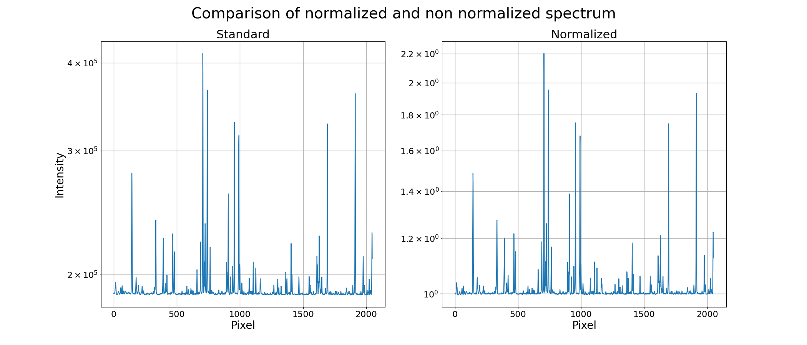
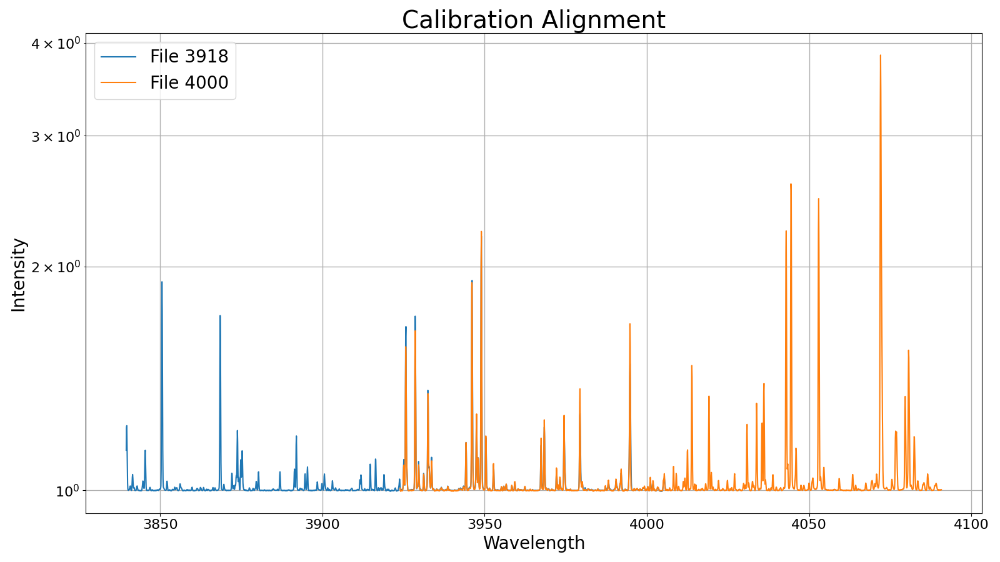
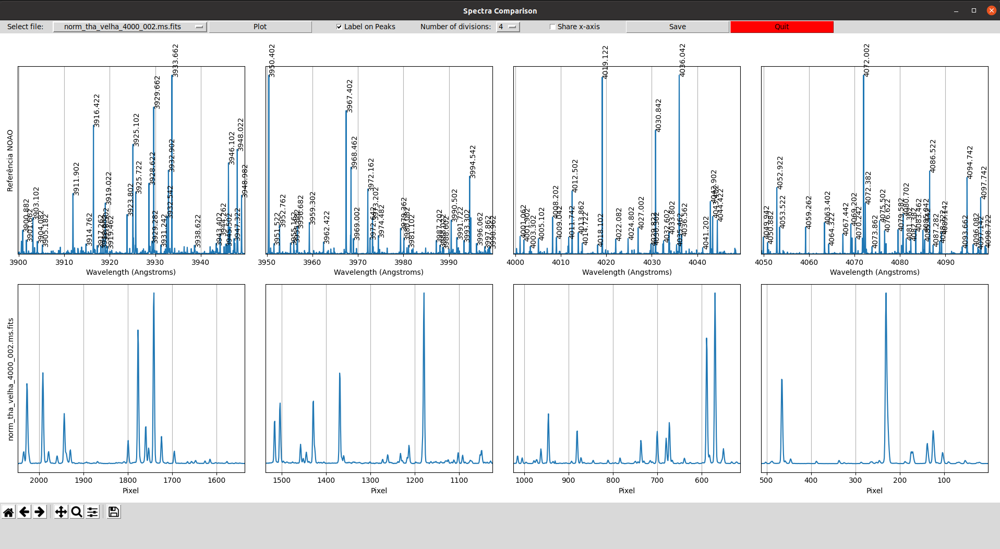
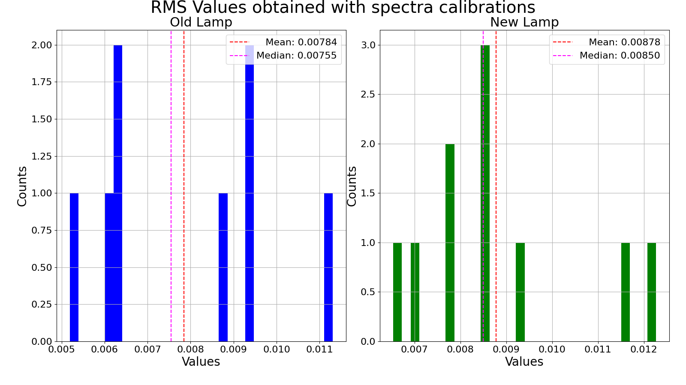
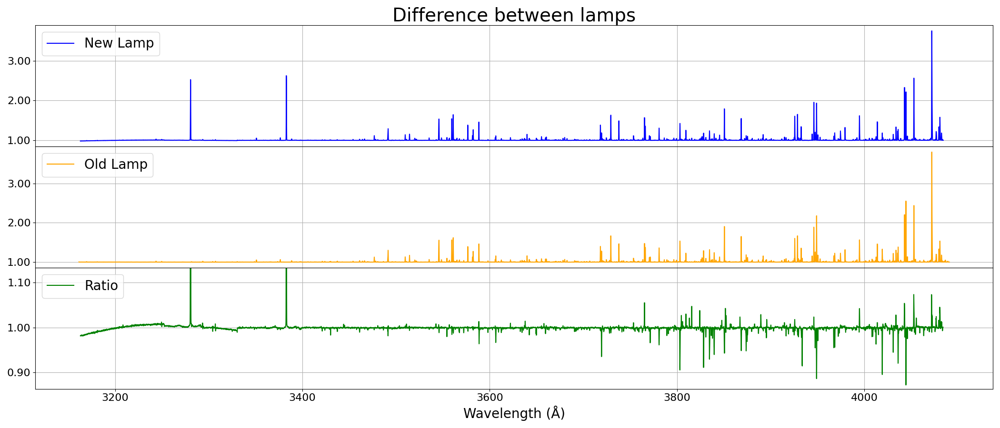

# Spectra Comparator
The programs listed bellow aim to analyze and characterize the Photron Lamp spectrum and compare it with the Westinghouse Lamp, both are Thorium-Argon lamps. Lamps specifications can be found [here](http://iraf.noao.edu/specatlas/).  

The IRAF procedures used can be found [here](iraf.md)  

This project was done under grant #2020/14944-4, São Paulo Research Foundation (FAPESP) and the monograph with all the results are available [here](tese.pdf).

## plot_norms.py
[File](plot_norms.py)  
Program to plot the spectra before and after the normalization. Search for two types of file names:

- `tha_` for non-normalized spectrum and;
- `norm_tha_` for normalized spectrum.

And the rest of the name needs to be the wavalength information.  
Obs: part of the name string will be used to write the plot name.  

Example:


## specplot.py
[File](specplot.py)  
Program to visually verify the calibration. For **N** spectra, **N-1** plots will be generated, each with two spectra to compare the alignment of the emission lines.

Example:


## calib.py
[File](calib.py)  
Comparison between a file named "thar.fits" (reference file) and any other *.fits* spectra with the string *tha_* in part of the name of the file.  

This program shows a interactive window created with Python3 that uses matplotlib to enable interact with the spectra while running the script. The plot created can also be saved.  

It has options to divide the spectra from 1 to 10 on horizontal axis. If the x axis is the same unit on both spetras it can also share the same limits on the axis to enable a better comparison.  

If the x axis is in Angstrons, the program has an option to show the wavelength of the peaks.  

Interface example:


## rms_compar.py
[File](rms_compar.py)  
A simple program to plot the RMS values of the calibration obtained with IRAF. This program read a *.csv* file as the following example:

```csv
Wavelength(A),	RMS_Old,	RMS_New
3240,		0.09712,	0.01160
3330,		0.04782,	0.00935
3415,		0.01131,	0.00855
```

Where each line is a spectrum file calibrated in the Westinghouse (old) and the Photron (new) lamp.

The execution of the program generate a table saved in LaTeX (*.tex*) format and an example can be found [here](rms.tex). It also create an image as follows:



## divide_spectra.py
[File](divide_spectra.py)  
Plot the Westinghouse and Photron spectra, followed by the division of them (created in IRAF).

**Disabled:** The execution of the program accepts (optional) one argument to plot the figure sharing the y-axis for all the subplots. The execution is like the following one:

```bash
python3 divide_spectra.py sharey
```

Example:


## analyse_spectra.py
[File](analyse_spectra.py)  

## resolution_degradation.py
[File](resolution_degradation.py)  

## spectrum_analysis.r
[File](spectrum_analysis.r)  
