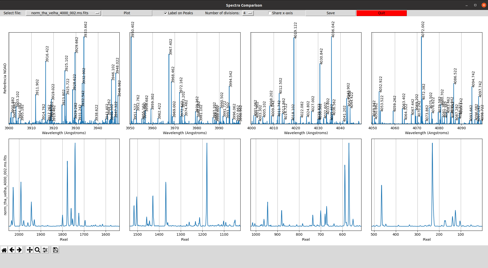

# Spectra Comparator
The programs listed bellow aims to analyse and characterize the Photron Lamp spectrum and compare it with the Westinghouse Lamp, both are Thorium-Argon lamps. The lamps specifications can be found [here](http://iraf.noao.edu/specatlas/).

## plot_norms.py

## specplot.py

## calib.py

## rms_compar.py

## divide_spectra.py

## analyse_spectra.py

## resolution_degradation.py

## spectrum_analysis.r

# Spectra Comparator
Comparison between a file named "thar.fits" (reference file) and any other *.fits* spectra with the string *tha_* in part of the name of the file.  

This program shows a interactive window created with Python3 that uses matplotlib to enable interact with the spectra while running the script.   The plot created can also be saved.  

It has options to divide the spectra from 1 to 10 on horizontal axis. If the x axis is the same unit on both spetras it can also share the same limits on the axis to enable a better comparison.  

If the x axis is in Angstrons, the program has an option to show the wavelength of the peaks.  

